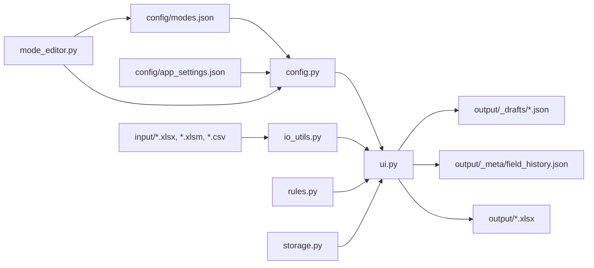

# Offline Dialogue Labeler Pro

Оффлайн Windows-приложение для ручной разметки диалоговых данных из Excel и CSV без сервера, базы данных и интернета.

Проект нужен в тех случаях, когда:

- есть таблица с диалогами, которую нужно быстро и стабильно размечать руками;
- данные нельзя отправлять во внешние сервисы;
- разметчикам нужен простой `.exe`, который можно передать как папку и запустить локально;
- схема разметки должна меняться без переписывания кода под каждый новый проект.

Приложение читает входные данные из `input/`, показывает диалог, даёт форму разметки по выбранному режиму, валидирует ответ по правилам и сохраняет результат в Excel. Режимы разметки настраиваются через `config/modes.json` и встроенный конструктор режимов.

## Что умеет приложение

- работает полностью локально;
- читает `.xlsx`, `.xlsm` и `.csv`;
- использует колонки `session_id` и `text`;
- разбивает `text` на реплики по разделителю `//`;
- поддерживает несколько режимов разметки;
- позволяет редактировать режимы через встроенный конструктор;
- поддерживает типы полей `text`, `textarea`, `select`, `multiselect`, `checkbox`, `number`;
- поддерживает межполевые правила валидации;
- умеет реально блокировать поля через `require_empty`;
- поддерживает историю значений, подсказки и быстрый повтор часто используемых ответов;
- сохраняет черновики;
- экспортирует итог в Excel;
- собирается в Windows `.exe`, совместимый с Python `3.7.7`.

## Как пользоваться

### Быстрый сценарий для разметчика

1. Положить входной файл в папку `input/`.
2. Запустить приложение.
3. Выбрать режим разметки.
4. Выбрать файл из `input/` и нажать `Загрузить`.
5. Заполнять поля справа, двигаясь по диалогам.
6. При необходимости использовать:
   - `Показывать только неразмеченные`;
   - переход к записи по `session_id`;
   - `Сохранить черновик`;
   - `Статистика`;
   - `Конструктор режимов`.
7. Нажать `Выгрузить в Excel`, когда разметка готова.

### Что важно про входные данные

- Поддерживаемые форматы: `.xlsx`, `.xlsm`, `.csv`.
- Обязательные колонки: `session_id` и `text`.
- Остальные колонки игнорируются.
- Поле `text` разбивается на реплики по `//`.
- Если `session_id` повторяется, приложение всё равно сохраняет разметку корректно: под капотом используется устойчивый `annotation_key`, завязанный на строку файла.

### Что получает пользователь на выходе

- черновик в `output/_drafts/`;
- историю значений в `output/_meta/field_history.json`;
- итоговый Excel-файл в `output/` с листами `annotations` и `stats`.

## Архитектура проекта

### Слои



### Основные модули

- `run_app.py`
  - точка входа;
  - запускает `labeler.ui.run()`.
- `src/labeler/ui.py`
  - главное окно приложения;
  - загрузка файла, навигация по диалогам, рендер формы, сохранение черновиков, экспорт, статистика;
  - здесь находится основной пользовательский поток.
- `src/labeler/mode_editor.py`
  - визуальный конструктор режимов;
  - создание, дублирование, редактирование и валидация режимов, полей и правил.
- `src/labeler/config.py`
  - поиск корня проекта;
  - создание runtime-папок;
  - загрузка и сохранение `modes.json` и `app_settings.json`;
  - валидация схемы режимов;
  - backup-контура для `modes.json`.
- `src/labeler/io_utils.py`
  - чтение Excel/CSV;
  - нормализация записей;
  - работа с черновиками;
  - экспорт итогового Excel.
- `src/labeler/rules.py`
  - движок правил;
  - вычисление валидационных ошибок и предупреждений;
  - определение полей, которые должны быть заблокированы.
- `src/labeler/storage.py`
  - история значений по полям;
  - подсказки и автодополнение.
- `src/labeler/models.py`
  - базовые модели и перечисления;
  - создание пустой аннотации по схеме режима.

### Как проходит жизненный цикл данных

1. Приложение стартует и через `config.py` убеждается, что есть папки `input/`, `output/`, `config/` и служебные подпапки.
2. Из `config/modes.json` загружаются режимы разметки.
3. Пользователь выбирает файл, а `io_utils.py` читает его и превращает строки в список `DialogueRecord`.
4. `ui.py` строит форму разметки из описания полей выбранного режима.
5. При каждом изменении значений `rules.py` пересчитывает валидацию и disabled-состояние полей.
6. `storage.py` обновляет подсказки и историю значений по уже сохранённым аннотациям.
7. Черновик сохраняется в JSON, а итоговая выгрузка формируется в Excel.

## Структура репозитория

```text
offline_labeler/
├── build_windows.bat
├── run_app.py
├── requirements.txt
├── config/
│   ├── app_settings.json
│   └── modes.json
├── input/
├── output/
│   ├── _drafts/
│   └── _meta/
└── src/
    └── labeler/
        ├── config.py
        ├── io_utils.py
        ├── mode_editor.py
        ├── models.py
        ├── rules.py
        ├── storage.py
        └── ui.py
```

## Как устроен `modes.json`

`modes.json` описывает весь контракт разметки. Один режим содержит:

- `id`
- `name`
- `version`
- `description`
- `instructions`
- `examples`
- `change_log`
- `fields`
- `rules`

### Поля

Каждое поле обычно содержит:

- `key` — технический идентификатор;
- `label` — подпись в UI;
- `type` — тип поля;
- `required` — обязательность;
- `help` — пояснение;
- `examples` — примеры для разметчика;
- `default` — значение по умолчанию;
- `options` — список опций для `select` и `multiselect`.

Поддерживаемые типы:

- `text`
- `textarea`
- `select`
- `multiselect`
- `checkbox`
- `number`

Для numeric default можно использовать `None`: в конфигураторе это видно как `None`, а в рантайме трактуется как настоящее пустое значение, а не как строка.

### Правила

Каждое правило содержит:

- `id`
- `description`
- `severity`
- `message`
- `if`
- `then`

Поддерживаемые операторы в `if`:

- `equals`
- `not_equals`
- `in`
- `not_empty`
- `empty`
- `is_true`
- `is_false`

Поддерживаемые действия в `then`:

- `require_filled`
- `require_empty`
- `require_value_in`

Особенности:

- `require_empty` не только валидирует, но и реально блокирует поле в форме;
- одно правило может управлять несколькими полями: в визуальном редакторе это выглядит как один rule с несколькими target-полями, а в JSON хранится как несколько actions внутри `then`;
- конструктор режимов умеет дублировать и поля, и правила.

### Минимальный пример режима

```json
{
  "id": "demo_mode",
  "name": "Демо режим",
  "version": "1.0",
  "description": "Пример простого режима",
  "instructions": "Выбери исход и при необходимости оставь комментарий.",
  "examples": [
    "Успех",
    "Отказ"
  ],
  "fields": [
    {
      "key": "outcome",
      "label": "Исход",
      "type": "select",
      "required": true,
      "options": ["Успех", "Отказ", "Не удалось определить"],
      "default": ""
    },
    {
      "key": "comment",
      "label": "Комментарий",
      "type": "textarea",
      "required": false,
      "default": ""
    }
  ],
  "rules": [
    {
      "id": "comment_for_refusal",
      "description": "При отказе нужен комментарий",
      "severity": "warning",
      "message": "Для отказа рекомендуется оставить комментарий.",
      "if": [
        {
          "field": "outcome",
          "op": "equals",
          "value": "Отказ"
        }
      ],
      "then": [
        {
          "type": "require_filled",
          "field": "comment"
        }
      ]
    }
  ]
}
```

## Конструктор режимов

Встроенный конструктор нужен, чтобы менять схему разметки без ручного редактирования JSON.

Что он умеет:

- создавать новый режим;
- дублировать режим;
- редактировать общие поля режима;
- вести `change_log`;
- добавлять, редактировать, удалять, дублировать и переставлять поля;
- добавлять, редактировать, удалять и дублировать правила;
- валидировать весь конфиг;
- сохранять `modes.json` с автоматическим backup в `config/_history/`;
- восстанавливать последний backup.

## Runtime-папки и артефакты

### `config/`

- `modes.json` — описание режимов разметки;
- `app_settings.json` — локальные настройки окна и последнего выбора;
- `_history/` — резервные копии `modes.json`.

### `input/`

- входные файлы для разметки.

### `output/`

- итоговые Excel-файлы;
- `_drafts/` — JSON-черновики;
- `_meta/` — служебные данные, включая историю полей.

## Локальный запуск из Python

### Windows

```bat
py -3.7 -m venv .venv
.venv\Scripts\activate.bat
python -m pip install -r requirements.txt
python run_app.py
```

### Что нужно для запуска из исходников

- Python `3.7.7+`;
- `tkinter`;
- `openpyxl`.

## Сборка `.exe` для Windows

Проект специально подготовлен под сборку в среде `Windows + Python 3.7.7`.

```bat
build_windows.bat
```

Сборочный скрипт:

- создаёт `.venv`, если её нет;
- проверяет наличие `tkinter`;
- ставит зависимости;
- собирает приложение через `PyInstaller 5.13.2`;
- кладёт готовый билд в `dist/OfflineDialogueLabelerPro/`.

Итоговый запускной файл:

```text
dist\OfflineDialogueLabelerPro\OfflineDialogueLabelerPro.exe
```

Разметчику нужно передавать всю папку `dist\OfflineDialogueLabelerPro\`, а не только `.exe`.

## Офлайн-сборка без доступа к внешнему PyPI

Если внешний индекс недоступен, можно положить рядом папку `wheelhouse/`. Тогда `build_windows.bat` попытается установить зависимости из неё.

Минимально нужны:

- `openpyxl==3.0.10`
- `pyinstaller==5.13.2`
- транзитивные зависимости PyInstaller для Windows

## Горячие клавиши

- `Ctrl+S` — сохранить черновик
- `Ctrl+Enter` — перейти к следующей записи
- `Alt+←` / `Alt+→` — навигация по диалогам
- стандартные `Ctrl+C`, `Ctrl+V`, `Ctrl+X`, `Ctrl+Z`, `Ctrl+Y`, `Ctrl+A` работают в редактируемых полях

## Ограничения и принципы проекта

- приложение ориентировано на диалоговые данные;
- основной источник контекста для записи — колонка `text`;
- разделение реплик сейчас завязано на `//`;
- хранилище локальное: JSON для черновиков и истории, Excel для итоговой выгрузки;
- проект намеренно остаётся простым: без БД, без веб-слоя и без фонового сервера.

## Демо-контент

- в `config/modes.json` уже лежат демо-режимы;
- на них удобно проверять разные типы полей, правила и disabled-сценарии.

## Лицензия

См. файл `LICENSE`.
